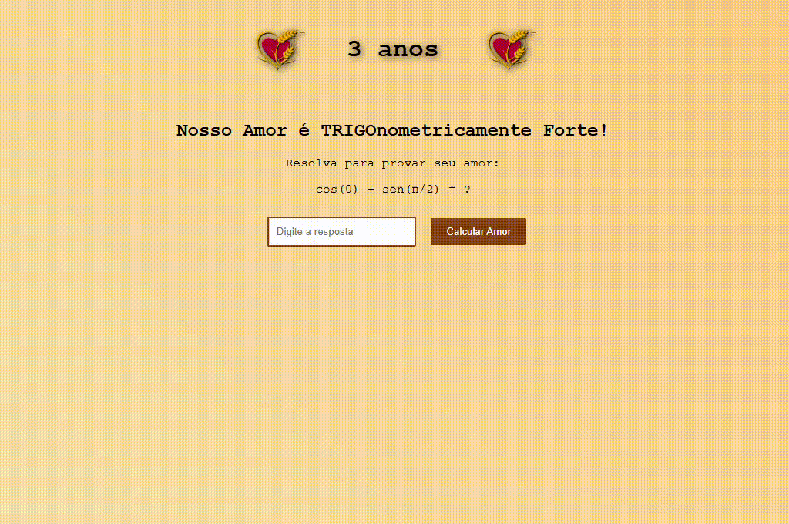

## Sobre o Projeto

TRIGOnometria é um projeto especial criado para celebrar 3 anos de casamento (Bodas de Trigo). 
É uma página web interativa que combina matemática e amor.

## Funcionalidades

- Interface interativa com animações suaves
- Desafio matemático baseado em trigonometria
- Respostas dinâmicas baseadas nas tentativas do usuário
- Animações especiais para celebrar a resposta correta

## Tecnologias Utilizadas

- HTML5
- CSS3 (com animações keyframe)
- JavaScript
- Gradientes e efeitos visuais

## Preview



## Como Executar

1. Clone este repositório
2. Abra o arquivo `index.html` em um navegador
   - Ou utilize uma extensão como Live Server no VS Code
3. Tente resolver o desafio matemático!

## Desafio Matemático

O projeto apresenta a seguinte questão trigonométrica:
```
cos(0) + sen(π/2) = ?
```
<br>
<br>

## PS para minha marida:
Sim, eu sei que a logo parece uma marca de padaria 😒

### Feito com 💖 e 🌾